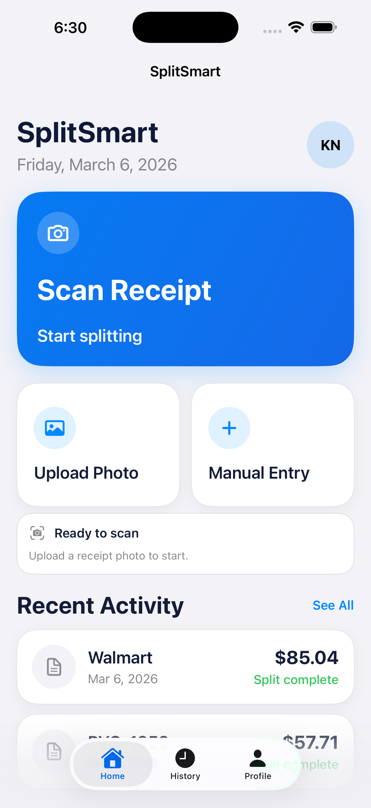

# SplitSmart

SplitSmart is an iOS receipt-splitting app built with SwiftUI and Firebase. It lets users scan or upload receipts, review OCR output before saving, split items across multiple people, and share finalized receipts with friends.

## Product Demo

### App Preview

| Home Screen | App Icon |
| --- | --- |
|  |  |

### Main User Flow

1. Sign in or create an account.
2. Start a receipt from the Home screen by scanning, uploading a photo, or using manual entry.
3. Review OCR-detected merchant, items, quantities, and totals before saving.
4. Adjust assignments so one item can belong to one or many people.
5. Save the receipt, revisit it in History, or share it with friends.
6. Accept incoming shared receipts directly from History.

## Features

- Camera scan and photo import for receipts
- Cloud OCR pipeline with editable in-app review
- Multi-person item assignment and split calculation
- Friend system with shared receipt workflows
- Private receipt history per account
- Firebase-backed authentication and storage

## Tech Stack

- SwiftUI
- Firebase Auth
- Cloud Firestore
- Firebase Storage
- Firebase Cloud Functions (Node.js)
- Google Cloud Document AI

## Architecture

- `ReceiptSplitter/`
  - SwiftUI app source, views, models, and services
- `ReceiptSplitterTests/`
  - iOS unit tests
- `functions/`
  - OCR processing logic and parser tests
- `docs/screenshots/`
  - README demo assets
- `firestore.rules`
  - Firestore access control
- `storage.rules`
  - Storage access control

## Local Development

### iOS App

1. Open `ReceiptSplitter.xcodeproj` in Xcode.
2. Select a simulator or physical device.
3. Build and run with `Cmd + R`.

### Firebase Backend

1. Create a Firebase project.
2. Enable:
   - Email/Password Authentication
   - Firestore
   - Storage
3. Add the iOS app and place `GoogleService-Info.plist` in `ReceiptSplitter/`.
4. Install Cloud Functions dependencies:

```bash
cd functions
npm install
```

5. Deploy backend resources:

```bash
firebase deploy --only firestore:rules,storage,functions --project recieptsplitter
```

## Testing

### iOS Tests

```bash
xcodebuild test -project ReceiptSplitter.xcodeproj -scheme ReceiptSplitter -destination 'platform=iOS Simulator,name=iPhone 17 Pro Max'
```

### Functions Tests

```bash
cd functions
npm test
```

## Notes

- `GoogleService-Info.plist` contains a Firebase client API key, which is expected for iOS Firebase apps.
- Security is enforced through Firebase Auth, Firestore and Storage rules, API key restrictions, and App Check configuration.
